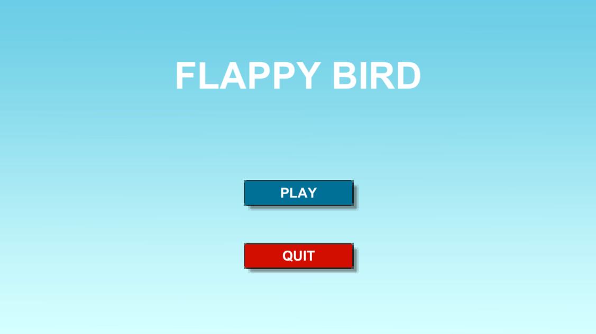
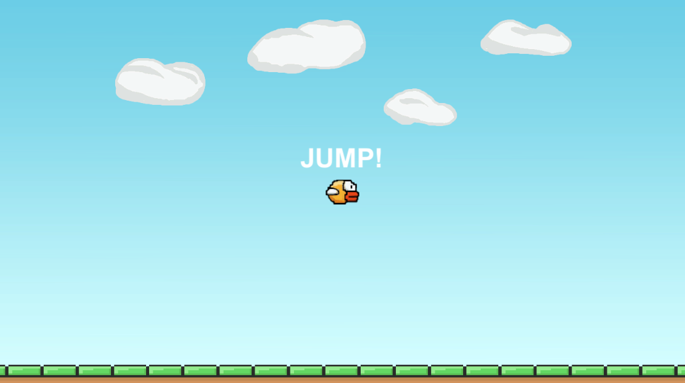
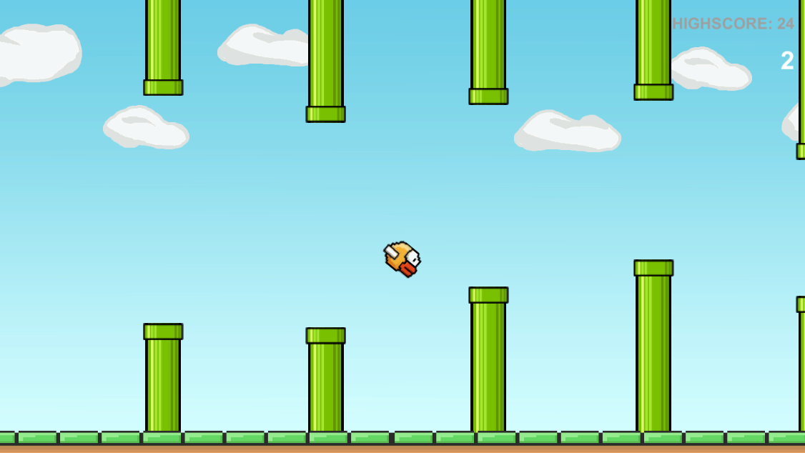

# Flappy Bird Clone
A flappy bird clone built in Unity as I learn the basics of how to use the engine

Includes basic features, such as restart, event handling, state management, and high scores

Based on the following YouTube video:
[https://www.youtube.com/watch?v=b5Wpni9KPik](https://www.youtube.com/watch?v=b5Wpni9KPik)

## Gameplay Screenshots

